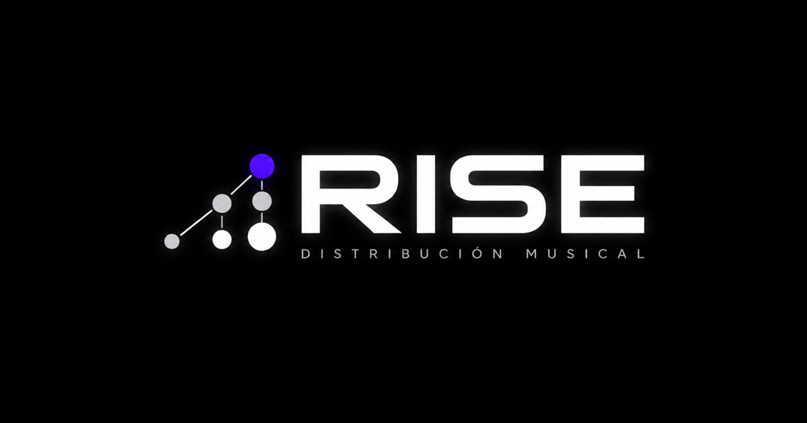

# Rise Difusión

**Una presencia digital para acompañar la música desde la distribución hasta su encuentro con el público.**

Caso de estudio de diseño y desarrollo web por **TELLOUNDER**: una landing editorial con catálogo administrable para presentar servicios de distribución musical mediante RouteNote, difusión, letras y soluciones digitales para artistas independientes.

[Ver sitio publicado](https://risedifusion.com.ar/) · [Portfolio y contacto freelance](https://tellounder108.web.app/)

[](https://risedifusion.com.ar/)

## El problema

Distribuir una canción no alcanza para construir una presencia reconocible. La información de un lanzamiento suele quedar fragmentada entre plataformas, redes, letras, enlaces y conversaciones privadas; al mismo tiempo, los trabajos realizados necesitan actualizarse sin editar el código de la landing.

La solución reúne esas necesidades en una experiencia directa: explica cada servicio, muestra los canales de distribución, presenta artistas y proyectos, responde dudas frecuentes y prepara una consulta personalizada por WhatsApp. Un panel privado permite mantener el catálogo visual sin intervenir el frontend.

## Alcance de la entrega

TELLOUNDER desarrolló la dirección visual, la interfaz adaptable, las interacciones, el modelo de contenido, la administración privada, el procesamiento de imágenes, la integración con Firebase, el SEO técnico y la publicación en el dominio propio.

El proyecto permite evaluar una entrega comercial completa: identidad, comunicación, comportamiento responsive, contenido administrable, seguridad y una base técnica que otro equipo puede ejecutar y revisar.

## Decisiones que se pueden comprobar

| Necesidad | Implementación | Código |
| --- | --- | --- |
| Presentar servicios sin una estructura corporativa rígida | Landing de una sola página, jerarquía editorial y llamados directos a conversar. | [Landing pública](src/App.tsx) |
| Explicar el alcance real de la distribución | RouteNote se presenta como la compañía utilizada para gestionar el envío a plataformas, con condiciones visibles. | [Servicios y canales](src/App.tsx) |
| Actualizar trabajos sin editar código | Panel con Google Authentication para crear, modificar, ordenar, ocultar y eliminar hasta 15 cards. | [Administración](src/Admin.tsx) · [Modelo de cards](src/projectCards.ts) |
| Mantener el proyecto dentro del plan gratuito | Las imágenes se comprimen a WebP en el navegador y se almacenan dentro de Firestore; no se utiliza Firebase Storage. | [Procesamiento administrativo](src/Admin.tsx) |
| Proteger las escrituras sin ocultar el catálogo | Lectura pública de `projectCards` y escritura restringida a correos verificados y autorizados. | [Reglas de Firestore](firestore.rules) |
| Dar señales coherentes a buscadores y redes | Canonical, Open Graph, Twitter Cards, JSON-LD, sitemap y robots sobre el dominio oficial. | [Metadatos](index.html) · [Sitemap](public/sitemap.xml) |
| Conservar continuidad técnica entre sesiones | Contexto canónico consultable mediante un RAG-lite local, sin APIs ni embeddings externos. | [Contexto del proyecto](knowledge/CANONICAL_CONTEXT.md) · [Buscador](scripts/context.mjs) |

## Arquitectura

**React · TypeScript · Vite · Firebase Authentication · Cloud Firestore · Firebase Hosting · Font Awesome**

La landing se compila como frontend estático. Firestore aporta las cards administrables y el bundle conserva una selección inicial para que la página nunca quede vacía si la colección todavía no fue inicializada. La seguridad efectiva reside en Authentication y en las reglas de Firestore.

```text
src/App.tsx                     Landing, servicios, plataformas y contacto
src/Admin.tsx                   Panel privado y procesamiento de imágenes
src/projectCards.ts             Contrato, contenido inicial y suscripción
src/firebase.ts                 Inicialización del SDK web
src/styles.css                  Sistema visual público y administrativo
knowledge/                      Contexto canónico y RAG-lite local
scripts/context.mjs             Recuperación y control de documentación
public/                         SEO, imagen social, robots y sitemap
firestore.rules                 Autorización y validación de escrituras
```

## Ejecutar y revisar

Con **Node.js 22.12 o posterior**:

```bash
npm ci
npm run dev
```

```bash
npm run context:check
npm run build
npm run preview
```

La landing pública puede recorrerse sin credenciales. El panel `/admin` requiere Google Authentication con una cuenta autorizada conjuntamente en el frontend y en las reglas de Firestore.

[Desarrollo local](docs/desarrollo.md) · [Administración](docs/administracion.md) · [SEO y publicación](docs/seo.md) · [Créditos y alcance de uso](docs/creditos.md)

## Contexto recuperable

El repositorio incluye un RAG-lite documental sin servicios externos. Divide la documentación canónica por secciones y recupera los bloques más relevantes para una consulta.

```bash
npm run context:search -- "cards e imágenes"
npm run context:search -- "Firebase admin"
npm run context:search -- "dominio y SEO"
npm run context:check
```

Este mecanismo aporta continuidad, pero el código y el runtime siguen siendo la fuente de verdad.

## Sobre el desarrollo

Este caso reúne branding digital, frontend responsive, administración de contenido, Firebase y SEO aplicado a un servicio musical. Para proyectos freelance o colaboración con equipos de desarrollo: **[conocé otros trabajos y contactá a TELLOUNDER](https://tellounder108.web.app/)**.

**Marca, logotipo, imágenes y contenido musical: Rise Difusión y sus respectivos autores.**

La publicación del código como caso de estudio no concede permiso para reutilizar la marca, las imágenes, las piezas musicales ni la identidad de Rise Difusión. Las dependencias conservan sus licencias correspondientes.

Diseño y desarrollo por **TELLOUNDER**.
